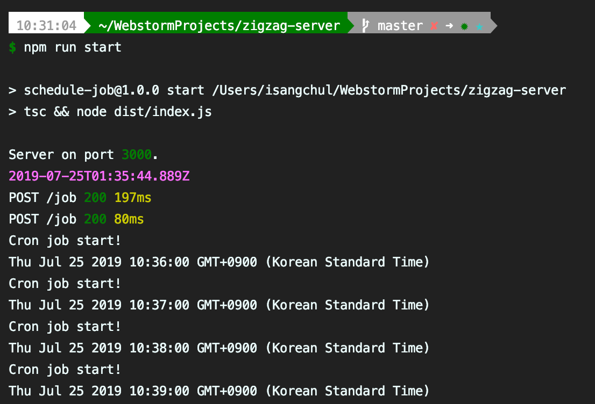

# Node.js Cron job practice

This is simple node-cron job practice API server.

Overview
---

- Using: `Node.js`, `TypeScript`, `MySQL`, `node-cron`
- TODO: `Mocha`, `Swagger`, `Node-mailer`
- [~~More~~]()~~(This is written in Korean)~~

Features
---
Use `node-cron` to manage a single or periodic schedule. 

1. Time log.
2. OS usage.
3. ~~Mail sending.~~
4. ~~DB backup.~~
5. Managing schedules(APIs).

Quick start
---
```bash
$ npm install
$ npm start
```

Tests
---
~~Using Mocha.~~

TODO

API Spec & Example
---
| Path | Method | Body | Description | Response | Status |
|:----:|:------:|:-----------:|:---------------------------------------:|:-------------------------------:|:--------:|
| /list | `GET` | `None` | 리스트를 가져옵니다.(5개) | `[{"seq": number, "created": date,"runtime": date,"type": string,"isloop": boolean}, {...}, ...]` | 200 OK |
| /list/:seq | `GET` | `None` | 리스트를 가져옵니다.(seq 이후 - 페이징 처리) |  위와 동일 | 200 OK |
| /job/:seq | `GET` | `None` | Job 하나를 가져옵니다. | seq 에 해당하는 {...} 하나 | 200 OK |
| /job | `POST` | `{"year": number, "month": number, "day": number, "hour": number, "minute": number, "isLoop": boolean, "type": string}` | Job 을 등록합니다. | `True/False` | 200 OK |
| /job/:seq | `PUT` | 위와 동일 | seq 에 해당하는 Job 을 수정합니다. | `True/False` | 200 OK |
| /job/:seq | `DELETE` | `None` | seq 에 해당하는 Job 하나를 지웁니다. | `True/False` | 200 OK |



LICENSE
---
This is released under the MIT license. See [LICENSE](LICENSE) for details.
